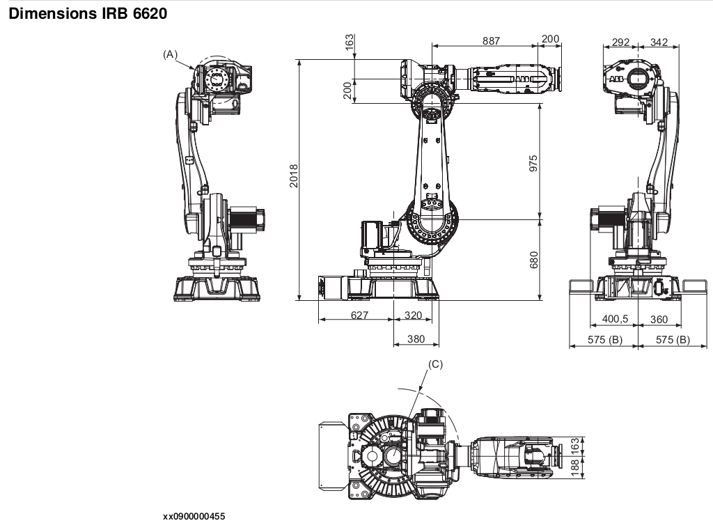

# NMX template v3

The `main.py` script in this directory generates Box detectors for an existing
instrument template.

## Usage

1. Prepare a jinja2 template for the instrument. This repo provides one at `examples/nmx/template_nmx_v3.0_baseline.json.j2`
1. Create a virtual environment and install requirements.txt from this directory.
1. Run main.py passing the template and an output file:
`python examples/nmx/main.py -t examples/nmx/template_nmx_v3.0_baseline.json.j2 -o nmx_v3.0_with_detectors.json`

## NMX parameters

The parameters of NMX detectors are set as global variables in `main.py`.

While testing templates, you can generate smaller files by setting the `FACTOR` variable
from `1` to a higher value like `80`. This will generate `1/80` of the pixels, but make 
them `80` times larger.


## Tests

```
pytest examples/tests/test_nmx_geometry.py
```


## Background information

### Detectors

* Generated via python as NeXus Constructor does not support Box detectors 
with gaps at this time.
* The three detector panels are generated in the x-y plane and then rotated 
and moved into their base position. This means that panel pixels use x and y
coordinates despite not being aligned with the x/y axes after the applied 
transformations.

  * Translations are used instead of offsets, as the NeXus Constructor does not
yet support offsets (see ECDC-3526).

* Pixel offsets:

  * `x_pixel_offset` and `y_pixel_offset` are aligned with the x-y plane, therefore
  every detector row has an identical `x` array, and every column has an identical
  `y` array. As per the NeXus standard, we can then provide those single arrays instead
  of 2-dimensional arrays.
  * `z_pixel_offset` is generated as a single value of zero: `[0]`.


### Robot arms

Only preliminary specifications are available, thus the modelling into NeXus 
is just a preliminary version based on the following:

* Robot model: Arinax IRB 6620 as per tender document.
* The zero positions have been guessed from this image: 
